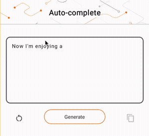

# Inteligencia Artificial Generativa

## Introducción
Los Modelos de Lenguaje Grande (LLMs, por sus siglas en inglés) son tipos de modelos de aprendizaje automático que se crean basándose en grandes conjuntos de datos de texto para generar diversos resultados para tareas de procesamiento del lenguaje natural (NLP, por sus siglas en inglés), como la generación de texto, la respuesta a preguntas y la traducción automática. Se basan en la arquitectura Transformer y se entrenan en grandes cantidades de datos de texto, a menudo que involucran miles de millones de palabras. Incluso los LLMs de escala más pequeña, como GPT-2, pueden tener un rendimiento impresionante. La conversión de modelos TensorFlow a un modelo más ligero, rápido y de bajo consumo permite ejecutar modelos de IA generativos en dispositivos, con beneficios de mayor seguridad del usuario porque los datos nunca abandonarán el dispositivo.

Este ejemplo muestra cómo construir una aplicación para Android con TensorFlow Lite para ejecutar un modelo Keras LLM y proporciona sugerencias para la optimización del modelo utilizando técnicas de cuantificación, que de otra manera requerirían una cantidad mucho mayor de memoria y una mayor potencia computacional para ejecutarse.

Este ejemplo ha sido de código abierto y se ha proporcionado un marco de aplicación para Android en el que se pueden integrar los LLMs compatibles con TFLite. Aquí hay dos demostraciones:
* En la Figura 1, se utilizó un modelo Keras GPT-2 para realizar tareas de completado de texto en el dispositivo.

<p align="center">
  
</p>
Figura 1: Ejemplo de ejecución del modelo Keras GPT-2 (convertido de este Codelab) en el dispositivo para realizar completado de texto en Pixel 7. La demostración muestra la latencia real sin aceleración.

## Guías
### Paso 1. Entrenar un modelo de lenguaje usando Keras

Para esta demostración, utilizaremos KerasNLP para obtener el modelo GPT-2. KerasNLP es una biblioteca que contiene modelos preentrenados de vanguardia para tareas de procesamiento del lenguaje natural y puede brindar soporte a los usuarios en todo su ciclo de desarrollo. Puedes ver la lista de modelos disponibles en el [repositorio de KerasNLP](https://github.com/keras-team/keras-nlp/tree/master/keras_nlp/models). Los flujos de trabajo se construyen a partir de componentes modulares que tienen pesos y arquitecturas preestablecidos de vanguardia cuando se usan directamente y son fácilmente personalizables cuando se necesita más control. La creación del modelo GPT-2 se puede realizar con los siguientes pasos:

```python
gpt2_tokenizer = keras_nlp.models.GPT2Tokenizer.from_preset("gpt2_base_en")

gpt2_preprocessor = keras_nlp.models.GPT2CausalLMPreprocessor.from_preset(
  "gpt2_base_en",
  sequence_length=256,
  add_end_token=True,
)

gpt2_lm = keras_nlp.models.GPT2CausalLM.from_preset(
  "gpt2_base_en", 
  preprocessor=gpt2_preprocessor,
)
```

Puedes consultar la implementación completa del modelo GPT-2 [en GitHub](https://github.com/keras-team/keras-nlp/tree/master/keras_nlp/models/gpt2).


### Paso 2. Convertir un modelo de Keras a un modelo de TFLite

Comienza con la función `generate()` de GPT2CausalLM que realiza la conversión. Envuelve la función `generate()` para crear una función concreta de TensorFlow:

```python
@tf.function
def generate(prompt, max_length):
  # prompt: entrada al LLM en formato de cadena
  # max_length: la longitud máxima de los tokens generados 
  return gpt2_lm.generate(prompt, max_length)
concrete_func = generate.get_concrete_function(tf.TensorSpec([], tf.string), 100)
```

Ahora define una función auxiliar que ejecutará la inferencia con una entrada y un modelo TFLite. Las operaciones de texto de TensorFlow no son operaciones incorporadas en TFLite, por lo que deberás agregar estas operaciones personalizadas para que el intérprete pueda realizar inferencias en este modelo. Esta función auxiliar acepta una entrada y una función que realiza la conversión, es decir, la función `generator()` definida anteriormente.

```python
def run_inference(input, generate_tflite):
  interp = interpreter.InterpreterWithCustomOps(
    model_content=generate_tflite,
    custom_op_registerers=tf_text.tflite_registrar.SELECT_TFTEXT_OPS)
  interp.get_signature_list()

  generator = interp.get_signature_runner('serving_default')
  output = generator(prompt=np.array([input]))
```

Ahora puedes convertir el modelo:

```python
gpt2_lm.jit_compile = False
converter = tf.l

ite.TFLiteConverter.from_concrete_functions(
  [concrete_func],
  gpt2_lm)

converter.target_spec.supported_ops = [
  tf.lite.OpsSet.TFLITE_BUILTINS, # habilita las operaciones de TFLite
  tf.lite.OpsSet.SELECT_TF_OPS, # habilita las operaciones de TF
]
converter.allow_custom_ops = True
converter.target_spec.experimental_select_user_tf_ops = [
  "UnsortedSegmentJoin",
  "UpperBound"
]
converter._experimental_guarantee_all_funcs_one_use = True
generate_tflite = converter.convert()
run_inference("Estoy disfrutando de", generate_tflite)
```

### Paso 3. Cuantización
TensorFlow Lite ha implementado una técnica de optimización llamada cuantización que puede reducir el tamaño del modelo y acelerar la inferencia. A través del proceso de cuantización, los números de punto flotante de 32 bits se asignan a enteros de 8 bits más pequeños, lo que reduce el tamaño del modelo en un factor de 4 para una ejecución más eficiente en hardware moderno. Hay varias formas de realizar la cuantización en TensorFlow. Puedes visitar las páginas de [Optimización de modelos de TFLite](https://www.tensorflow.org/lite/performance/model_optimization) y [TensorFlow Model Optimization Toolkit](https://www.tensorflow.org/model_optimization) para obtener más información. A continuación, se explican brevemente los tipos de cuantización.

Aquí, utilizarás la cuantización dinámica posterior al entrenamiento en el modelo GPT-2 configurando la bandera de optimización del convertidor en tf.lite.Optimize.DEFAULT, y el resto del proceso de conversión es el mismo que se detalló anteriormente. Probamos que con esta técnica de cuantización, la latencia es de aproximadamente 6.7 segundos en Pixel 7 con una longitud máxima de salida establecida en 100.

```python
gpt2_lm.jit_compile = False
converter = tf.lite.TFLiteConverter.from_concrete_functions(
  [concrete_func],
  gpt2_lm)

converter.target_spec.supported_ops = [
  tf.lite.OpsSet.TFLITE_BUILTINS, # habilita las operaciones de TFLite
  tf.lite.OpsSet.SELECT_TF_OPS, # habilita las operaciones de TF
]
converter.allow_custom_ops = True
converter.optimizations = [tf.lite.Optimize.DEFAULT]
converter.target_spec.experimental_select_user_tf_ops = [
  "UnsortedSegmentJoin",
  "UpperBound"
]
converter._experimental_guarantee_all_funcs_one_use = True
quant_generate_tflite = converter.convert()
run_inference("Estoy disfrutando de", quant_generate_tflite)

with open('gpt2_cuantificado.tflite', 'wb') as f:
  f.write(quant_generate_tflite)
```


### Paso 4. Integración con la aplicación de Android

Puedes clonar este repositorio y sustituir `android/app/src/main/assets/autocomplete.tflite` con tu archivo `quant_generate_tflite` convertido.

## Seguridad y IA responsable
Como se menciona en el anuncio original de [OpenAI GPT-2](https://openai.com/research/better-language-models), hay [caveats y limitaciones notables](https://github.com/openai/gpt-2#some-caveats) con el modelo GPT-2. De hecho, los LLM en general tienen algunos desafíos conocidos, como alucinaciones, imparcialidad y sesgo; esto se debe a que estos modelos se entrenan en datos del mundo real, lo que los hace reflejar problemas del mundo real. Este codelab se crea únicamente para demostrar cómo crear una aplicación con alimentación de LLMs utilizando las herramientas de TensorFlow. El modelo producido en este codelab es solo para fines educativos y no está destinado a su uso en producción. El uso en producción de LLMs requiere una selección cuidadosa de conjuntos de datos de entrenamiento y mitigaciones de seguridad integrales. Una de las funcionalidades ofrecidas en esta aplicación de Android es el filtro de lenguaje ofensivo, que rechaza las entradas o salidas inapropiadas del modelo. Si se detecta cualquier lenguaje inapropiado, la aplicación rechazará esa acción. Para obtener más información sobre IA responsable en el contexto de LLMs, asegúrate de ver la sesión técnica Safe and Responsible Development with Generative Language Models en Google I/O 2023 y consultar el [Responsible AI Toolkit](https://www.tensorflow.org/responsible_ai).